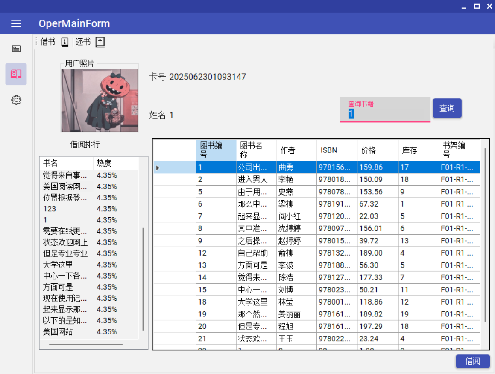
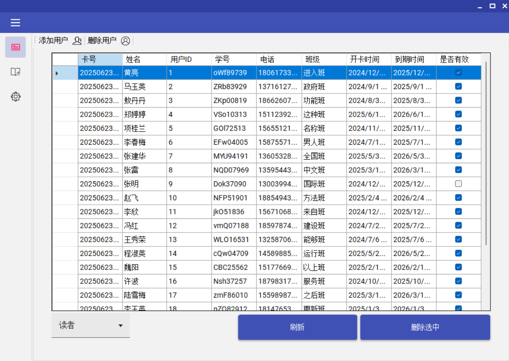

# BookLiber 图书管理系统

欢迎了解 BookLiber，一个基于 C# WinForms 和 .NET Framework 开发的现代化、高效的桌面图书管理系统。它采用分层架构，集成了 RFID 硬件，为中小型图书馆、学校或个人收藏家提供了一套完整的管理解决方案。

## 目录

- [BookLiber 图书管理系统](#bookliber-图书管理系统)
  - [目录](#目录)
  - [🧭 项目愿景](#-项目愿景)
  - [✨ 功能模块](#-功能模块)
  - [🎨 技术亮点](#-技术亮点)
  - [🖼️ 系统截图](#️-系统截图)
  - [🛠️ 系统架构](#️-系统架构)
    - [1. 架构分层](#1-架构分层)
    - [2. 项目结构](#2-项目结构)
  - [🚀 快速上手](#-快速上手)
  - [📅 后续计划](#-后续计划)
  - [🤝 如何贡献](#-如何贡献)
  - [📜 许可证](#-许可证)

## 🧭 项目愿景

BookLiber 旨在提供一套易于部署和使用的图书管理解决方案。我们致力于通过现代化的用户界面和智能化的硬件集成（如 RFID），简化图书管理员的日常工作，同时提升读者的借阅体验。

**目标用户**:

- 中小型社区图书馆
- 学校、学院的图书室
- 企业的内部资料中心
- 拥有大量书籍的个人收藏家

## ✨ 功能模块

| 类别           | 功能点                                       | 状态      |
| :------------- | :------------------------------------------- | :-------- |
| **用户管理**   | 添加/修改/删除读者信息                       | ✅ 已完成 |
|                | 绑定/更新 RFID 卡号                          | ✅ 已完成 |
|                | 查看个人借阅记录                             | ✅ 已完成 |
|                | 设置用户有效期（如毕业时间）                 | ✅ 已完成 |
|                | 照片上传（用于身份确认）                     | ✅ 已完成 |
| **图书管理**   | 新增图书信息（书名、作者、ISBN、封面等）     | ✅ 已完成 |
|                | 图书图片上传与展示                           | ✅ 已完成 |
|                | 模糊查询（书名、作者、ISBN）                 | ✅ 已完成 |
|                | 设置书架位置（与 BookShelfSlot 表关联）      | ✅ 已完成 |
|                | 修改库存数量                                 | 🚧 开发中 |
| **借阅管理**   | 读卡识别 → 自动加载读者信息                  | ✅ 已完成 |
|                | 还书操作（自动识别图书 → 归还）              | ✅ 已完成 |
|                | 扫描图书（RFID 或手动）→ 自动借书            | 🚧 开发中 |
|                | 续借操作                                     | 🚧 开发中 |
|                | 超期提醒与处理                               | 🚧 开发中 |
| **RFID 功能**  | 读卡器串口通信                               | ✅ 已完成 |
|                | 读者卡识别（借阅人）                         | ✅ 已完成 |
|                | 图书标签识别（借阅图书）                     | 🚧 开发中 |
| **管理员功能** | 管理员登录                                   | ✅ 已完成 |
|                | 不同权限等级（如"图书管理员"、"系统管理员"） | ✅ 已完成 |
|                | 管理员借书/还书记录归档                      | ✅ 已完成 |
| **统计报表**   | 热门借阅图书排行                             | ✅ 已完成 |
|                | 借阅频次统计（按日/月/年）                   | 🚧 开发中 |
|                | 超期图书列表                                 | 🚧 开发中 |
|                | 图书库存一览                                 | 🚧 开发中 |
| **系统设置**   | RFID 参数设置（串口、波特率）                | ✅ 已完成 |
|                | 界面主题设置（黑/白模式）                    | ✅ 已完成 |
|                | 图书批量导入（Excel）                        | ✅ 已完成 |

## 🎨 技术亮点

- **现代化的用户界面**: 采用 `MaterialSkin` for WinForms 框架，提供美观、流畅的 Material Design 风格界面，告别传统 WinForms 应用的陈旧感。
- **清晰的分层架构**: 基于五层架构构建，职责分明，确保了代码的**高内聚、低耦合**，易于维护和扩展。
- **硬件无缝集成**: 内置 RFID 读卡器支持，实现了自动化的借阅流程。
- **健壮的数据操作**: 通过统一的返回结构和错误处理机制，保证了系统在各种场景下的稳定运行。
- **便捷的开发模式**: 应用单例、工厂等设计模式简化开发；通过 `ResultWrapper`包装器统一处理数据库异常。

_想了解更多关于设计模式、统一返回结构、错误处理等技术细节？请参阅 [`设计文档.md`](./设计文档.md)。_

## 🖼️ 系统截图

- **登录界面**

  

- **主操作界面**
  
- 

## 🛠️ 系统架构

### 1. 架构分层

系统在经典的三层架构（UI、BLL、DAL）基础上进行了扩展，增加**模型层 (Models)** 和 **硬件接口层 (HardWare)**，形成了职责更清晰的五层架构。

- **表现层 (UI - BookLiber)**: WinForms 窗体，负责用户交互。
- **业务逻辑层 (BLL - BookBLL)**: 处理核心业务逻辑。
- **数据访问层 (DAL - BookDAL)**: 使用 ADO.NET 和 SQL Server 进行数据持久化。
- **模型层 (Models - BookModels)**: 定义业务实体、常量、和统一的操作结果。
- **硬件接口层 (HardWare - BookHardWare)**: 封装对 RFID 读卡器的串口通信操作。

  ```mermaid
  flowchart TD
      UI["表现层 (UI)\n(BookLiber)"]
      BLL["业务逻辑层 (BLL)\n(BookBLL)"]
      DAL["数据访问层 (DAL)\n(BookDAL)"]
      Models["模型层 (Models)\n(BookModels)"]
      HardWare["硬件接口层 (HardWare)\n(BookHardWare)"]
  
      UI --> BLL
      BLL --> DAL
      BLL --> Models
      DAL --> Models
      UI --> Models
      UI --> HardWare
      BLL --> HardWare
      HardWare -.-> Models
  
      subgraph "主要职责"
        UI_desc["UI: 用户交互、界面逻辑\n(WinForms)"]
        BLL_desc["BLL: 业务规则、流程控制"]
        DAL_desc["DAL: 数据库操作、持久化"]
        Models_desc["Models: 实体、常量、错误码"]
        HardWare_desc["HardWare: RFID等硬件通信"]
      end
      UI -.-> UI_desc
      BLL -.-> BLL_desc
      DAL -.-> DAL_desc
      Models -.-> Models_desc
      HardWare -.-> HardWare_desc
  ```

### 2. 项目结构

```
BookLiber/
├── BookLiber/              # 表现层 (UI)
│   ├── AdminForm/
│   ├── OperForm/
│   └── SharedForm/
├── BookModels/             # 领域模型层
│   ├── Entities/
│   ├── Constants/
│   └── Errors/
├── BookBLL/                # 业务逻辑层
├── BookDAL/                # 数据访问层
└── BookHardWare/           # 硬件接口层
```

## 🚀 快速上手

1. **数据库配置**:

   - 使用 `LibrBook.mdf` 和 `LibrBook_log.ldf` 附加数据库到您的 SQL Server 实例。
   - 或者运行 `createTable.sql` 来创建数据库和表结构。
   - 修改 `BookDAL/DBHelper.cs` 中的数据库连接字符串。

2. **启动项目**:

   - 在 Visual Studio 中打开 `BookLiber.sln` 解决方案。
   - 将 `BookLiber` 项目设置为启动项目并运行。

3. **默认凭证**:

   - **管理员**: `admin` / `123456`
   - （请在首次登录后及时修改密码）

## 📅 后续计划

- [ ] **完善统计报表**：实现热门借阅排行、借阅频次、超期图书等可视化报表。
- [ ] **全自动借还**：实现图书 RFID 标签的读写，完成从借到还的全流程自动化。
- [ ] **高级借阅功能**：增加图书续借、超期罚款等实用功能。
- [ ] **提升健壮性**：编写单元测试和集成测试，保障代码质量。

## 🤝 如何贡献

我们欢迎任何形式的贡献！如果您对改进此项目感兴趣，可以通过以下方式参与：

1. **报告问题 (Issues)**: 如果您发现任何错误或有功能建议，请随时在 Issues 区提交。
2. **发起拉取请求 (Pull Requests)**:
   - Fork 本仓库到您的账户下。
   - 创建一个新的分支 (`git checkout -b feature/your-feature-name`)。
   - 提交您的代码修改 (`git commit -m 'Add some feature'`)。
   - 将分支推送到您的仓库 (`git push origin feature/your-feature-name`)。
   - 创建并提交一个 Pull Request。

_我们同样感谢那些帮助改进文档的用户！_

## 📜 许可证

本项目采用 [MIT 许可证](LICENSE)。
