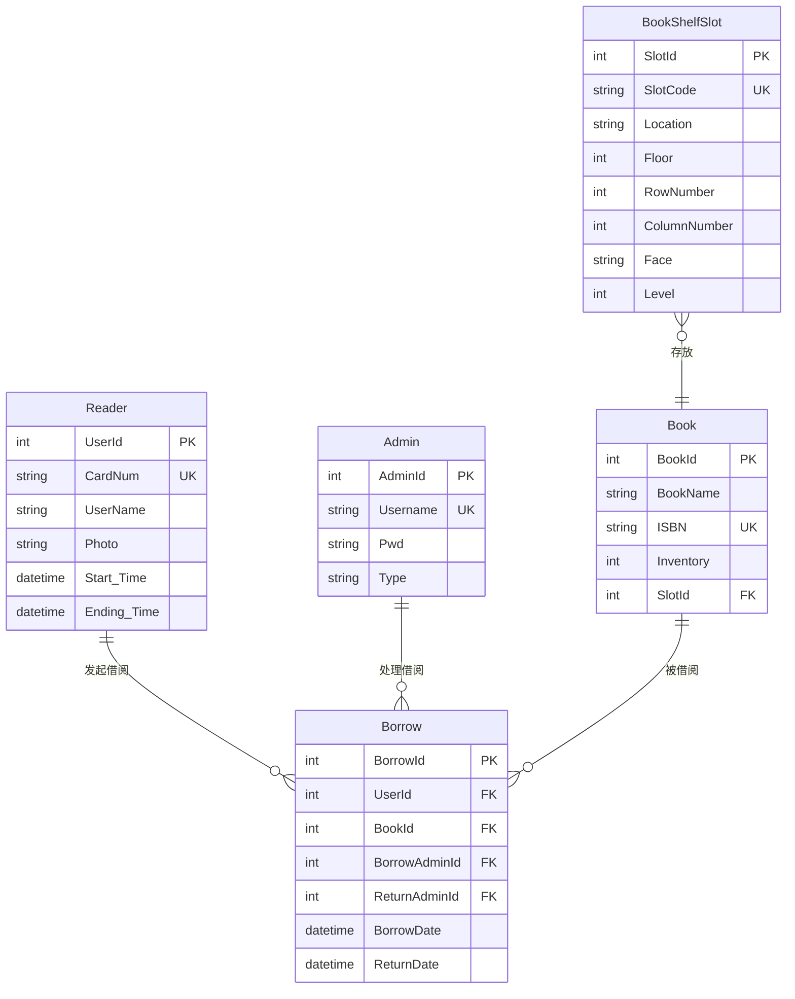

# 项目设计文档

[TOC]

本文档深入介绍了 BookLiber 项目的核心设计，包括软件设计模式和数据库结构。

---

## 1. 软件设计

本节阐述了项目中使用的一些核心技术、设计模式和实现细节。

### 1.1. 设计模式应用

#### 单例模式 (Singleton)

```csharp
// MaterialSkinManager 单例
materialSkinManager = MaterialSkinManager.Instance;

// Reader 单例
Reader.Instance = sutInfoRes.Data;
```

#### 工厂模式 (Factory)

```csharp
// 窗体创建工厂
private void InitializeForms() {
    forms = new Dictionary<string, Form> {
        { "readCard", new ReadCardForm() },
        { "borrow", new BorrowForm() },
        { "return", new ReturnForm() },
        { "card", new CardForm() },
        { "addBook", new AddBookForm() }
    };
}
```

#### 观察者模式 (Observer)

```csharp
// 窗体切换观察者
private void materialTabControl1_SelectedIndexChanged(object sender, EventArgs e) {
    HideAllForms();
    switch (materialTabControl1.SelectedIndex) {
        case 0:  // 卡管理标签页
            ShowForm("readCard");
            break;
        case 1:  // 借阅管理标签页
            ShowForm("borrow");
            break;
        case 2:  // 图书管理标签页
            ShowForm("addBook");
            break;
    }
}
```

#### 依赖注入 (Dependency Injection)

虽然项目未采用完整的 DI 框架，但通过构造函数传递依赖（如此处的 `MaterialSkinManager` 单例）也体现了依赖注入的思想，降低了耦合度。

```csharp
public class ReadCardForm : MaterialForm {
    private readonly MaterialSkinManager materialSkinManager;

    public ReadCardForm() {
        InitializeComponent();
        materialSkinManager = MaterialSkinManager.Instance;
    }
}
```

### 1.2. 统一返回结构

系统使用统一的返回结构 `OperationResult<T>` 处理所有操作结果，使调用方能清晰地处理成功和失败的场景。

```csharp
public class OperationResult<T> {
    public bool Success { get; set; }
    public string Message { get; set; }
    public T Data { get; set; }
    public int ErrorCode { get; set; }
}
```

**使用示例：**

```csharp
// 成功返回
return new OperationResult<Reader> {
    Success = true,
    Message = "获取读者信息成功",
    Data = reader
};

// 错误返回
return new OperationResult<Reader> {
    Success = false,
    Message = "未找到读者信息",
    ErrorCode = ErrorCodes.READER_NOT_FOUND
};
```

### 1.3. 包装器模式 (Wrapper)

系统使用包装器模式封装底层操作，简化上层调用。

#### 包装器 (`OperationResult`.Wrap)

```csharp
public static OperationResult<TData> Wrap<TData>(Func<TData> func) {
            try {
                TData result = func();
                return OperationResult<TData>.Ok(result);
            }
            catch (SqlException ex) {
                if (IsConflictError(ex))
                    return OperationResult<TData>.Fail(
                        ErrorCode.DuplicateKey,
                        GetMessage(ErrorCode.DuplicateKey, ex.Message));
                return OperationResult<TData>.Fail(
                    ErrorCode.DatabaseError,
                    GetMessage(ErrorCode.DatabaseError, ex.Message));
            }
            catch (Exception ex) {
                return OperationResult<TData>.Fail(
                    ErrorCode.UnknownError,
                    GetMessage(ErrorCode.UnknownError, ex.Message));
            }
}
```

### 1.4. 工具类 (Utils)

系统提供了多个工具类来简化开发。

#### 结果包装器 (`ResultWrapper`)

`ResultWrapper` 封装了所有数据库操作的 `try-catch` 逻辑，极大简化了 BLL 层的代码，使其能更专注于业务本身，而无需重复编写大量异常处理代码。

```csharp
public static class ResultWrapper {
    // 封装带返回值的操作（如查询、登录等）
    public static OperationResult<TData> Wrap<TData>(Func<TData> func) {
        try {
            TData result = func();
            return OperationResult<TData>.Ok(result);
        }
        catch (SqlException ex) {
            if (IsConflictError(ex))
                return OperationResult<TData>.Fail(
                    ErrorCode.DuplicateKey,
                    GetMessage(ErrorCode.DuplicateKey, ex.Message));
            return OperationResult<TData>.Fail(
                ErrorCode.DatabaseError,
                GetMessage(ErrorCode.DatabaseError, ex.Message));
        }
        catch (Exception ex) {
            return OperationResult<TData>.Fail(
                ErrorCode.UnknownError,
                GetMessage(ErrorCode.UnknownError, ex.Message));
        }
    }
}
```

#### SQL 错误映射器 (`SqlErrorMapper`)

将底层的 `SqlException` 错误码映射为业务定义的、更易于理解的 `ErrorCode`。

```csharp
public static class SqlErrorMapper {
    public static ErrorCode Map(SqlException ex) {
        switch (ex.Number) {
            case 2627:
                return ErrorCode.DuplicateKey; // 主键/唯一键冲突
            case 2601:
                return ErrorCode.DuplicateKey; // 唯一索引冲突
            case 547:
                return ErrorCode.ForeignKeyViolation; //外键冲突
        }
        return ErrorCode.DatabaseError; // 数据库错误
    }
}
```

### 1.5. 错误处理机制

系统实现了统一的错误处理机制，基于 `ErrorCode` 枚举和对应的消息字典。

```csharp
public enum ErrorCode {
    // 通用
    None = 0,                    // 操作成功，无错误
    UnknownError,                // 系统发生未知错误
    InvalidParameter,            // 参数格式无效
    DatabaseError,               // 数据库操作异常
    DuplicateKey,                // 数据重复违反唯一约束
    NotFound,                    // 未找到相关数据
    Unauthorized,                // 用户未授权
    Forbidden,                   // 禁止访问此资源
    Timeout,                     // 操作超时，请重试
    OperationFailed,             // 操作执行失败
    ForeignKeyViolation,         // 外键约束违反
    ...
}


private static readonly Dictionary<ErrorCode, string> _messages = new Dictionary<ErrorCode, string>(){
    // 通用错误
    { ErrorCode.None, "操作成功" },
    { ErrorCode.UnknownError, "系统发生未知错误" },
    { ErrorCode.InvalidParameter, "参数格式无效" },
    { ErrorCode.DatabaseError, "数据库操作异常" },
    { ErrorCode.DuplicateKey, "数据重复违反唯一约束" },
    { ErrorCode.NotFound, "未找到相关数据" },
    { ErrorCode.Unauthorized, "用户未授权" },
    { ErrorCode.Forbidden, "禁止访问此资源" },
    { ErrorCode.Timeout, "操作超时，请重试" },
    { ErrorCode.OperationFailed, "操作执行失败" },
    ...
}


 public static string GetMessage(ErrorCode code, string errorMessage = default) {
            // 判断errorMessage是否为null
            var res = _messages.TryGetValue(code, out var msg);

            msg = errorMessage != default
                ? msg + ":\n" + errorMessage
                : msg;

            return res
                ? msg
                : "未定义的错误";
 }
```

---

## 2. 数据库设计

本节详细说明了 BookLiber 项目的数据库结构。

### 2.1. 关系图 (ER Diagram)

下图展示了数据库中主要实体之间的关系。



### 2.2. 数据表结构 (SQL Schema)

以下是每个数据表的 `CREATE TABLE` 语句。

#### `Reader` - 读者表

存储读者的基本信息和借阅卡信息。原 `UserTable` 已更名为 `Reader` 以保持与代码模型一致。

```sql
CREATE TABLE Reader (
    UserId INT IDENTITY(1,1) PRIMARY KEY,                   -- 读者ID，主键
    CardNum VARCHAR(50) NOT NULL UNIQUE,                    -- RFID 卡号，唯一识别读者
    UserName NVARCHAR(50) NOT NULL,                         -- 姓名
    StudentID VARCHAR(20),                                  -- 学号（可选）
    Phone VARCHAR(20),                                      -- 电话号码
    Class NVARCHAR(50),                                     -- 班级/单位
    Photo NVARCHAR(255),                                    -- 照片路径（头像）
    Start_Time DATETIME NOT NULL,                           -- 注册时间
    Ending_Time DATETIME,                                   -- 有效截止时间
    IsActive BIT NOT NULL DEFAULT 1                         -- 卡号是否有效
);
```

#### `Admin` - 管理员表

存储系统管理员和操作员的账户信息和角色。

```sql
CREATE TABLE Admin (
    AdminId INT IDENTITY(1,1) PRIMARY KEY,                  -- 管理员ID，主键
    Username NVARCHAR(50) NOT NULL UNIQUE,                  -- 登录账号（唯一）
    Pwd NVARCHAR(255) NOT NULL,                             -- 登录密码（建议加密存储）
    Phone VARCHAR(20),                                      -- 联系方式
    Type NVARCHAR(20)                                       -- 角色类型，例如"超级管理员"、"图书管理员"
);
```

#### `BookShelfSlot` - 书架槽位表

定义了书架上的每一个具体放书的格子。

```sql
CREATE TABLE BookShelfSlot (
    SlotId INT IDENTITY(1,1) PRIMARY KEY,                   -- 槽位ID，主键
    Floor INT NOT NULL,                                     -- 楼层（1~3）
    RowNumber INT NOT NULL,                                 -- 排
    ColumnNumber INT NOT NULL,                              -- 列
    Face CHAR(1) NOT NULL CHECK (Face IN ('A','B')),        -- A面或B面
    Level INT NOT NULL CHECK (Level BETWEEN 1 AND 9),       -- 第几层格子
    SlotCode VARCHAR(30) UNIQUE NOT NULL,                   -- 书架格子编号，如 F01-R2-C3-A-05
    Location NVARCHAR(100)                                  -- 可读位置描述
);
```

#### `Book` - 图书表

存储每一本图书的详细信息。

```sql
CREATE TABLE Book (
    BookId INT IDENTITY(1,1) PRIMARY KEY,                   -- 图书ID，主键
    BookName NVARCHAR(100) NOT NULL,                        -- 图书名称
    Author NVARCHAR(100),                                   -- 作者
    ISBN VARCHAR(20) UNIQUE,                                -- 国际标准书号
    Price DECIMAL(10,2),                                    -- 单价
    Inventory INT NOT NULL DEFAULT 0,                       -- 当前库存数量
    Picture NVARCHAR(255),                                  -- 图书封面图片路径
    SlotId INT,                                             -- 外键，所在具体槽位
    CONSTRAINT FK_Book_Slot FOREIGN KEY (SlotId) REFERENCES BookShelfSlot(SlotId)
);
```

#### `Borrow` - 借阅记录表

记录每一次的图书借阅和归还操作。

```sql
CREATE TABLE Borrow (
    BorrowId INT IDENTITY(1,1) PRIMARY KEY,                 -- 借阅记录ID，主键
    UserId INT NOT NULL,                                    -- 外键：借书人ID
    BookId INT NOT NULL,                                    -- 外键：图书ID
    BorrowAdminId INT,                                      -- 外键：办理借书的管理员ID
    ReturnAdminId INT,                                      -- 外键：办理还书的管理员ID
    BorrowDate DATETIME NOT NULL,                           -- 借出时间
    ReturnDate DATETIME,                                    -- 归还时间（未归还为 NULL）
    CONSTRAINT FK_Borrow_Reader FOREIGN KEY (UserId) REFERENCES Reader(UserId),
    CONSTRAINT FK_Borrow_Book FOREIGN KEY (BookId) REFERENCES Book(BookId),
    CONSTRAINT FK_Borrow_Admin_Borrow FOREIGN KEY (BorrowAdminId) REFERENCES Admin(AdminId),
    CONSTRAINT FK_Borrow_Admin_Return FOREIGN KEY (ReturnAdminId) REFERENCES Admin(AdminId)
);
```

### 2.3. 书架定位规范

为了精确定位每一本书，我们设计了一套 `SlotCode` 编码规范。

| 字段     | 示例值         | 含义                                          |
| -------- | -------------- | --------------------------------------------- |
| SlotCode | F01-R2-C3-A-06 | 第 1 层楼，第 2 排第 3 列书架 A 面第 6 层格子 |

#### 图书定位示意图

```
┌────────────┬────────────┐
│ A面格子6    │ B面格子6    │ ← BookShelfSlot：Level=6, Face=A/B
│ A面格子5    │ B面格子5    │
│ ...        │ ...        │
│ A面格子1    │ B面格子1    │
└────────────┴────────────┘
         ↑ 中心隔板
```
